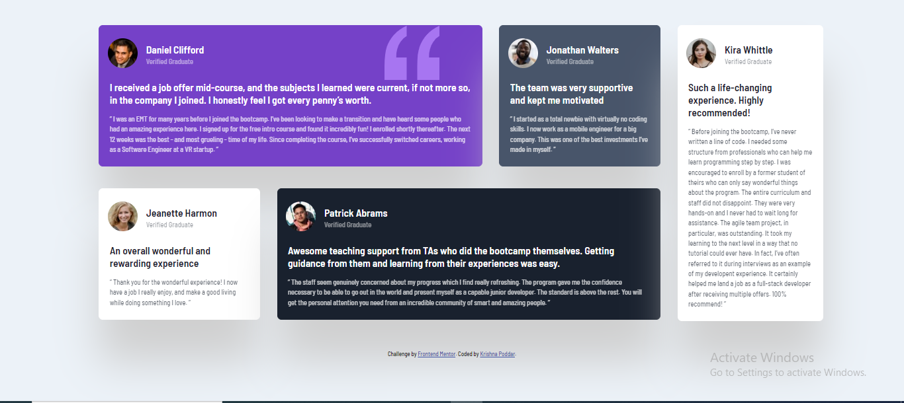
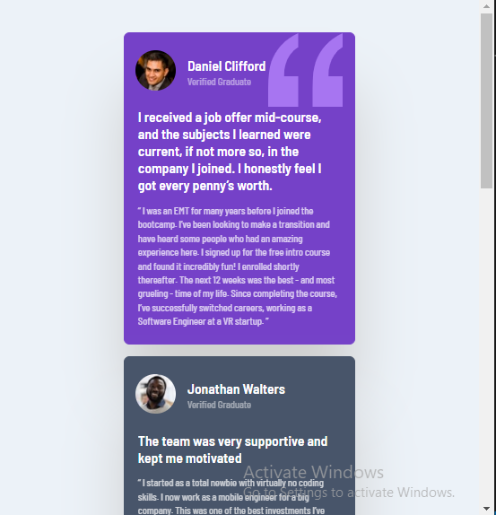

# Frontend Mentor - Testimonials grid section solution

This is a solution to the [Testimonials grid section challenge on Frontend Mentor](https://www.frontendmentor.io/challenges/testimonials-grid-section-Nnw6J7Un7). 

## Table of contents

- [Overview](#overview)
  - [The challenge](#the-challenge)
  - [Screenshot](#screenshot)
  - [Links](#links)
- [My process](#my-process)
  - [Built with](#built-with)
  - [What I learned](#what-i-learned)
  - [Continued development](#continued-development)
- [Author](#author)

## Overview

### The challenge

Users should be able to:

- View the optimal layout for the site depending on their device's screen size

### Screenshot

.PNG)

### Links

- Solution URL: [Git Hub Repo URL](https://github.com/KrishnaPoddar1/reviewtemplate.git)
- Live Site URL: [Live site URL](https://krishnapoddar1.github.io/reviewtemplate/)

## My process

### Built with

- Semantic HTML5 markup
- CSS custom properties
- Flexbox
- CSS Grid
- Mobile-first workflow
- Visual Studio Code

### What I learned

Using this project I got a better grasp of using CSS Flexbox and CSS Grid. 

### Continued development

Would love to perfect the useage of Flexbox and Grid

## Author

- Frontend Mentor - [@KrishnaPoddar1](https://www.frontendmentor.io/profile/KrishnaPoddar1)
